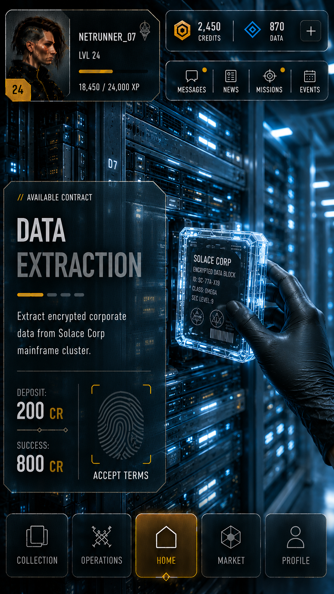
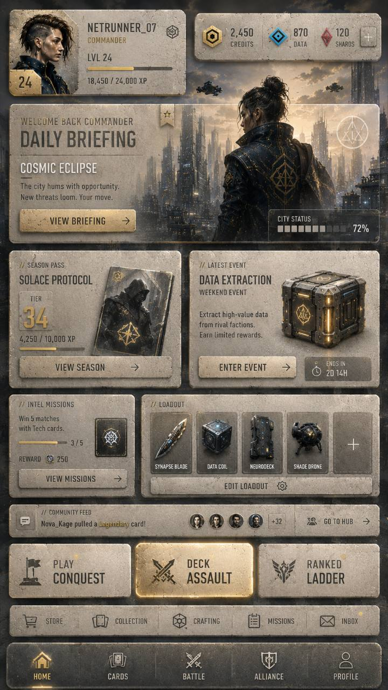
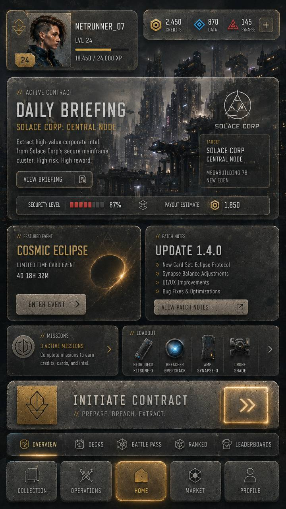
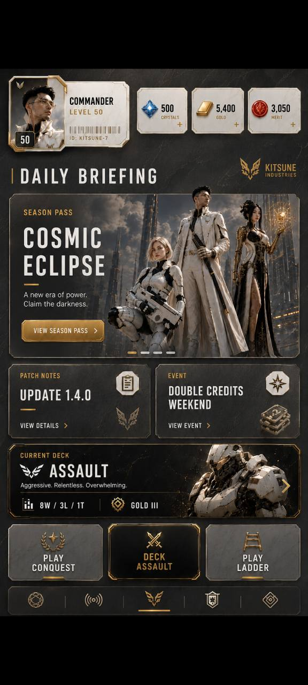
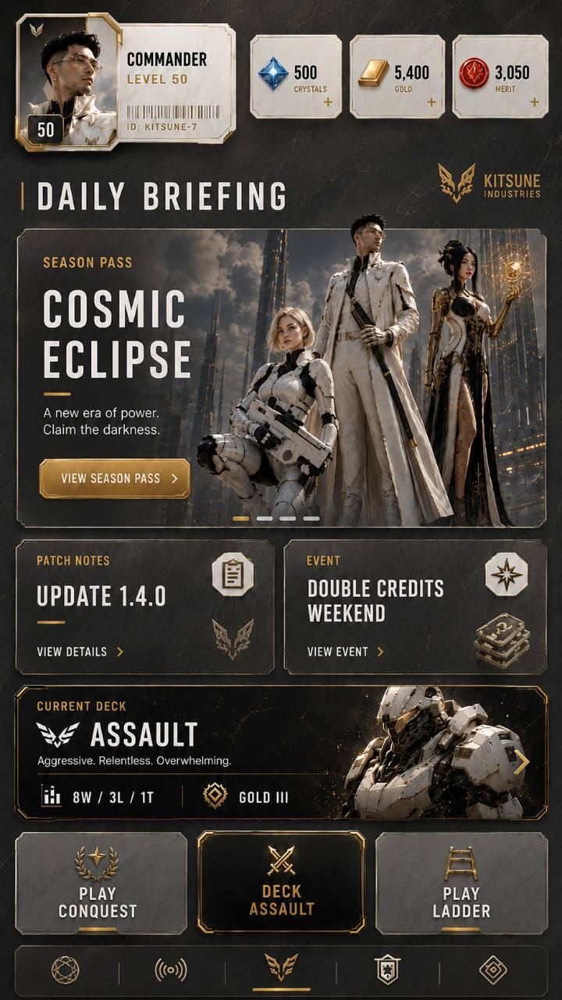

# UI Authoring Visual Capability Contract

Status: authoritative visual capability contract
Date: 2026-07-16
Parent: `docs/semantic-ui-authoring-compiler-spec.md`

## 1. Purpose

Define the visual range the UI authoring system must preserve and support while
its internals move toward semantic components and deterministic compilation.

The existing editor is useful migration evidence, but it is not the Mission
Briefing V2 art target. Architecture work must retain useful material and
interaction capabilities while enabling the approved target through semantic,
minimal, reproducible runtime output.

## 2. Reference set

These are AI-generated directional references. They are evidence for visual
language, component families, density, and material capability. Generated copy,
logos, icon details, and inconsistent geometry are not canonical product data.

### R0 — approved Mission Briefing V2 target

User-approved on 2026-07-16 as the Mission Briefing goal. For this milestone it
is authoritative for:

- the tall lower-left contract panel and its relationship to the 9:16 screen;
- full-bleed cyan/black environment art visible around and through the panel;
- clipped/chamfered panel geometry with thin light/gold edge accents;
- the title/body/progress/divider hierarchy and generous vertical rhythm;
- the split footer with deposit/success values on the left and fingerprint hold
  action on the right;
- restrained translucent glass, subtle hex texture, cool reflection, white
  condensed type, and localized gold emphasis.

The profile/resource/header and bottom navigation shown in R0 are composition
context owned by separate semantic components. Mission V2 must align with them,
but this milestone does not rebuild their product contracts.

### R1 — light worn-stone dashboard

Demonstrates:

- warm light stone/concrete panels with dark typography;
- dense modular dashboard composition;
- image-backed hero card mixed with opaque utility cards;
- shallow bevels, worn texture, hairline borders, and localized warm glow;
- compact profile, currency, event, mission, loadout, feed, CTA, and navigation
  components in one coherent skin.

### R2 — dark gunmetal and glass dashboard

Demonstrates:

- dark translucent gunmetal/glass surfaces over detailed city art;
- image blending and readable text without opaque full-card fills;
- restrained gold edge light, bevels, scratches, and inset highlights;
- compact status strips, resource chips, hero mission, secondary cards, CTA,
  tabs, and bottom navigation;
- active state conveyed by border/light treatment rather than structural change.

### R3/R4 — black, white, and gold daily briefing

Demonstrate:

- high-contrast black panels and light resource/profile chips in one theme;
- clipped/chamfered corners and thin metallic outlines;
- image-backed hero and deck cards with controlled text-safe regions;
- restrained gold buttons, separators, focus/active frames, and brand marks;
- a simpler composition that still shares the same logical component families.

Photo 5 from the supplied attachment set is a vehicle photograph and is not a
UI reference or product requirement.

## 3. Shared visual grammar

R0 and the four range references exercise one authoring capability, not
separate rendering systems. R0 is the Mission milestone destination; R1–R4 are
future range evidence.

| Axis | Required range |
| --- | --- |
| Base tone | light stone through dark gunmetal/black |
| Opacity | opaque utility slabs through translucent image-backed glass |
| Surface detail | worn grain, scratches, mottling, subtle noise/texture |
| Edge geometry | rounded rectangle, clipped/chamfered corner, shallow bevel |
| Edge paint | hairline border, inset highlight, outer shadow, localized glow |
| Reflection | restrained directional sheen/specular highlight |
| Accent | gold primary, cyan/data, red/warning, neutral white/gray |
| Media | cover image, focal position, darkening/fade, text-safe overlay |
| Typography | condensed headings, compact labels, tabular resource values |
| Composition | dense grid, hero region, status strip, card row, CTA, navigation |
| State | hover/focus/active/selected/disabled without changing component identity |

## 4. Required authoring capabilities

The editor must support the visual grammar through reusable component parts and
appearance graphs:

1. switch a component between light stone, dark glass/gunmetal, and black/gold
   appearances without changing its semantic component type;
2. edit ordered fill, texture, glass/blur, media overlay, border/bevel,
   reflection, shadow, and glow concepts;
3. control corner geometry, including clipped/chamfered treatments where the
   browser target supports them;
4. place media with cover/focal controls and a deterministic readability fade;
5. style named component states without duplicating the component tree;
6. compose compact profile, resource, mission/hero, event, loadout, status,
   CTA, tab, and navigation components while preserving their functions;
7. preview the real runtime component against representative dark and light
   backgrounds;
8. compile those concepts without one decorative DOM element per authored
   layer.

Supporting this range does not mean every component exposes every possible
control. Each semantic component exposes only the appearance parts and layout
variants appropriate to its purpose.

## 5. Checkpoint and target rule

Existing editor output is a protected migration checkpoint. R0 is the approved
Mission target.

- Capture representative current editor scenes before changing a renderer,
  material lowering rule, or recipe schema.
- Compare the old and new path using identical source data, content, viewport,
  assets, fonts, browser profile, and state.
- Architecture-only and behavior-only packets preserve the checkpoint unless a
  declared target-directed delta requires otherwise.
- Appearance/layout work intentionally replaces checkpoint composition with R0
  composition and must record which deltas are required by the target.
- Do not hide architecture changes inside unrelated visual retuning, and do not
  block required target work merely because it differs from the checkpoint.
- Do not remove the existing render path until the current vertical slice has
  semantic, interaction, DOM, deterministic-artifact, and visual parity proof.
- If a new compiler cannot reproduce a working existing capability, the
  compiler is incomplete; if it cannot express R0, the milestone is incomplete.

This is a strangler migration: one component and one appearance family cross
the new path at a time.

## 6. Capability proof matrix

The visual system is considered capable of the reference range when a small
representative proof set passes:

| Proof | Component | Appearance family | Required evidence |
| --- | --- | --- | --- |
| V1 | Mission Briefing | approved R0 cyan/black glass contract | target-conformance capture plus checkpoint regression record |
| V2 | utility/resource card | light worn stone | authored without component-specific decorative DOM |
| V3 | hero or deck card | black/gold image-backed | media fade, clipped edge, and state proof |
| V4 | navigation bar | dark/light theme swap | same semantic destinations and behavior in both skins |

Only V1 belongs to the first Mission Briefing implementation milestone. V2–V4
are future capability gates; they must not expand the first slice into a full
dashboard rebuild.

## 7. Stop rules

Stop and correct course if implementation work:

- proposes a ground-up renderer replacement before capturing current output;
- changes the visual look merely to simplify compiler lowering or to preserve
  an inaccurate checkpoint;
- creates separate schemas/renderers for the light, dark, or black/gold themes;
- adds component-specific CSS for a visual operation that belongs in the shared
  appearance compiler;
- spends time reproducing AI-generated text/logo errors rather than the shared
  visual grammar;
- broadens Mission Briefing V2 into simultaneous implementation of every card
  shown in the references.
